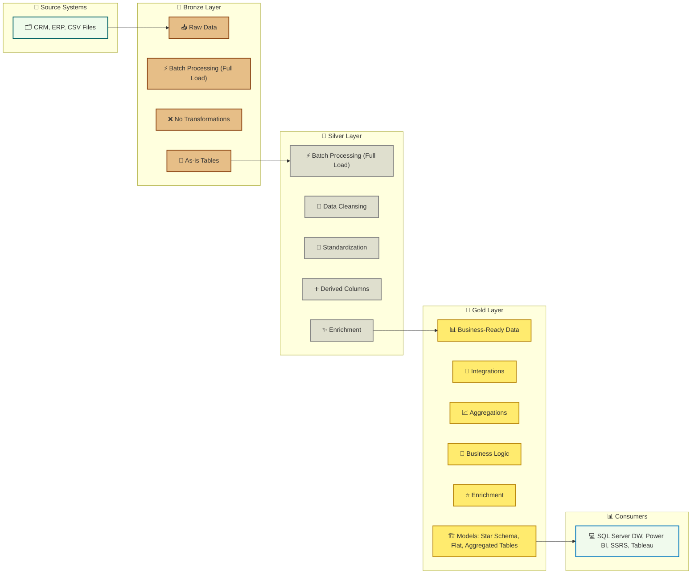

# sql-data-warehouse-project
Building a Data Warehouse with SQL Server, using ETL processes, data modeling and analytics

# 📊 Data Warehouse with SQL Server

  
  
  

---

## 🏗️ Overview
This project implements a **Data Warehouse** using **Microsoft SQL Server** as the foundation.  
It includes **ETL processes**, robust **data modeling**, and end-to-end **analytics** for decision-making.  
This project serves as a portfolio example, highlighting best practices in data engineering and analytics.

---

## ⚙️ Specifications
- 🗄 **SQL Server-based Data Warehouse**  
- 🔄 **ETL Pipelines** for data extraction, transformation, and loading  
- 🧩 **Star Schema Modeling**  
- 📈 **Analytics & Reporting Layer** (e.g., Power BI / SSRS)  
- ✅ **Data Quality & Governance Rules**: Cleansing & resolving data quality issues prior to the analysis

---
## 📂 Architecture – Medallion

The data warehouse follows the **Medallion Architecture** pattern with three main layers: **Bronze, Silver, and Gold**.

---
## 👋 About Me

Hi! I'm **André Graça** – a passionate developer 💻 with some experience in **MySQL** 🗄️ and **SQL** 🗄️. I love exploring data 📊 and am excited to embark on the **data engineering / data analysis journey** 🚀, turning raw information into actionable insights.

---

## 📝 License

This project is licensed under the **MIT License** [📄](https://opensource.org/licenses/MIT).

